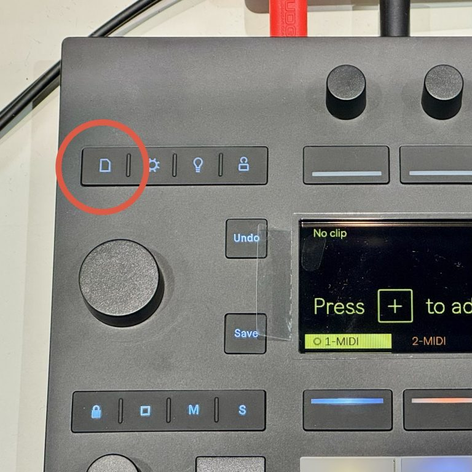
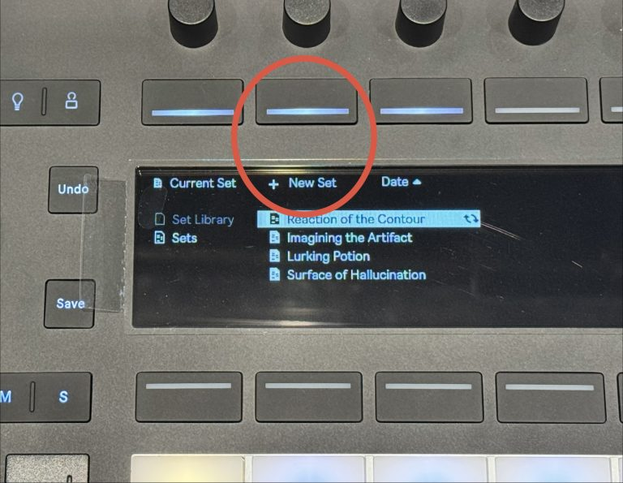
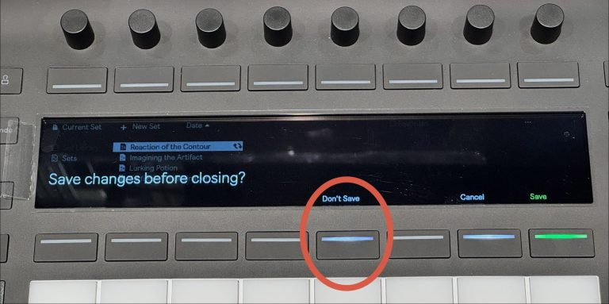
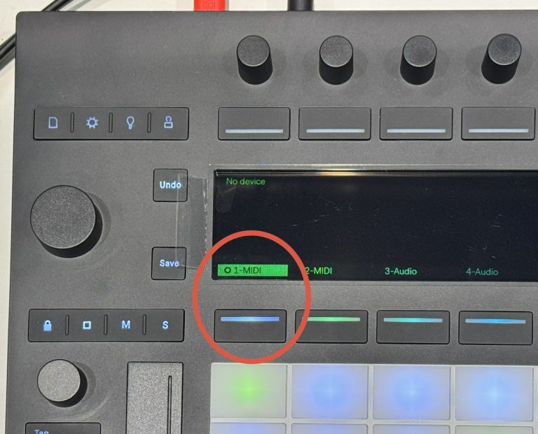
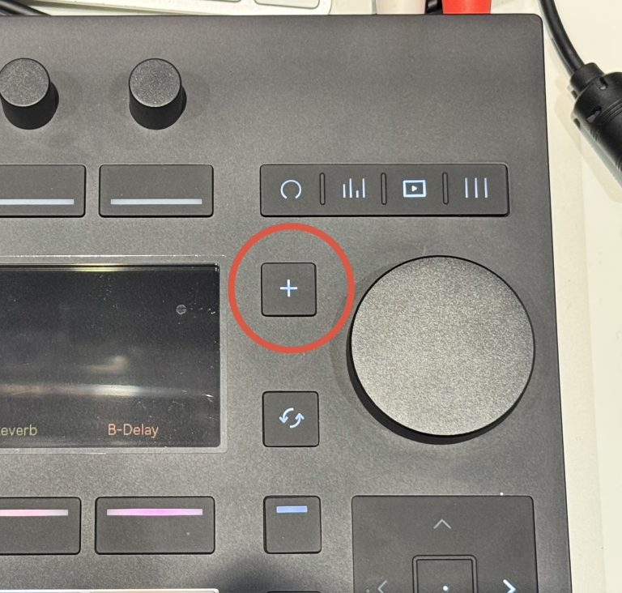
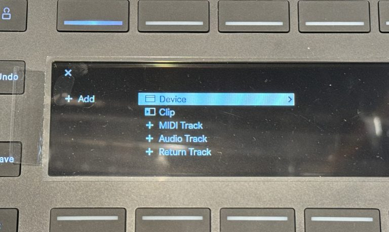
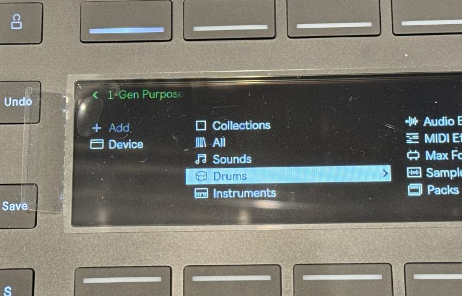
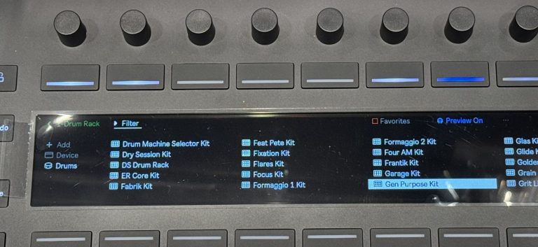
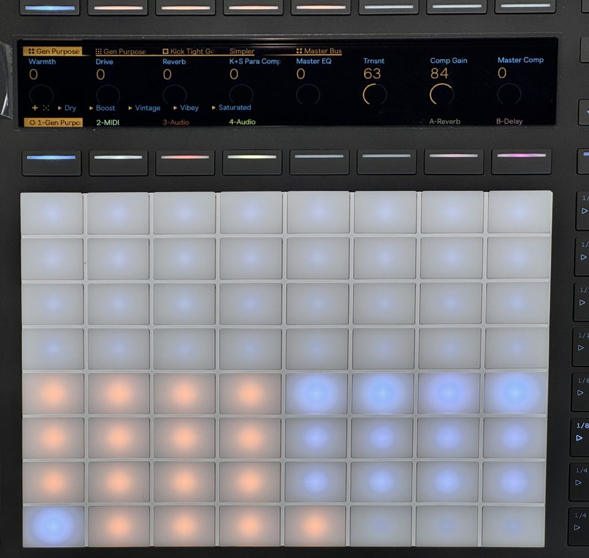
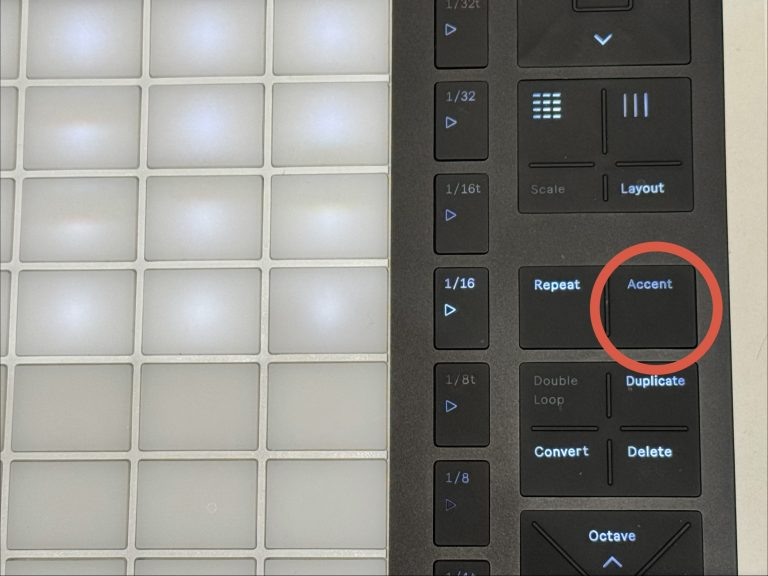

## Ableton Push 3 Standalone でフィンガードラムを出来るようにするまでの設定
---
### 新しいセットを作る

まずは何も入っていない空(から)の「曲」 "セット"を作成します。

①ページのマーク（紙がめくれてる感じのマーク）を押します。

② 画面に New Set ボタンが出てくるので、New Set の下のボタンを押します。

③ 既に開いているセットがあると保存するかを聞かれるので 保存しない場合は Don’t Save を選択します。

→ MIDIトラック 2つとAudioトラック 2つのセットが作られます。

---
#### トラックにドラム音源を読み込む

今回は生ドラムの音色で打ち込みをしてみます。

① MIDI 1 と書かれた下のボタンを押して、MIDIトラック を選択します。

② ジョグダイヤルの左上の「+（プラス）」ボタンを押します。

③ ジョグダイヤルを回して、Device > Drums > Gen Purpose Kit を選択します。
ジョグダイヤルの押し込みで「決定」です。

<figure>

<figcaption>Device</figcaption>
</figure>

<figure>

<figcaption>Device > Drums</figcaption>
</figure>
<figure>

<figcaption>Device > Drums > Gen Purpose Kit</figcaption>
</figure>

A~Zで並んでおり、「G (Gen Purpose Kit)」まで結構ジョグダイアルを回さないといけないため、
矢印キーを使うと便利です。

右矢印を使うとけっこう右に動けます。

---

 

8×8のパッドの左下に4×4のドラムパッドが作られ、 
ここまでの操作でフィンガードラムが出来るようになります!

Accent ボタンを押すことでベロシティ(強さ)が付かなくなり、
叩くのが少し簡単になります！

